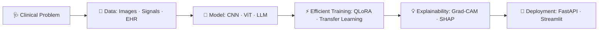

<div align="center">

<!-- ═══════════════ HEADER BANNER ═══════════════ -->


<!-- ═══════════════ TYPING ANIMATION ═══════════════ -->
<a href="https://jakirniloy.github.io/">
  
</a>

<br/><br/>

<!-- ═══════════════ SOCIAL BADGES ═══════════════ -->
<p>
  <a href="https://jakirniloy.github.io/"></a>
  <a href="https://www.linkedin.com/in/jakirniloy"></a>
  <a href="https://kaggle.com/mdjakirhossen"></a>
  <a href="mailto:mdjakirhossen13@gmail.com"></a>
</p>

<p>
  
  
  
</p>

</div>

<br/>

<!-- ═══════════════ ABOUT ═══════════════ -->
## 👨‍💻 &nbsp;About Me

> *"Building trustworthy AI for healthcare — models that are accurate, efficient, and explainable."*

I am an **AI researcher and data scientist** pursuing an **MS in Computer Science & Engineering (Data Science Track)** at **East West University (EWU), Dhaka, Bangladesh**. My work sits at the intersection of **medical AI**, **large language models**, and **computer vision**, with a strong emphasis on parameter-efficient training and model interpretability. I am currently preparing applications for **PhD programs in AI / Machine Learning**.

<table>
<tr>
<td width="50%" valign="top">

### 🎓 Academic Roles
- 🧑‍🏫 **Graduate Teaching Assistant** — East West University
- 💻 **Vice President** — EWU Programming Club
- 📚 **MS in CSE** — Data Science Track, EWU

</td>
<td width="50%" valign="top">

### 🎯 Current Focus
- 🔬 Medical LLMs with QLoRA / PEFT
- 🧬 Multimodal clinical diagnostics
- 💡 Explainable AI for healthcare
- 🚀 PhD applications in AI / ML

</td>
</tr>
</table>

<details>
<summary><b>🐍 View as Python class</b></summary>

```python
class JakirHossainNiloy:
    def __init__(self):
        self.name        = "Jakir Hossain Niloy"
        self.role        = "AI Researcher | Data Scientist"
        self.affiliation = "East West University (EWU), Dhaka, Bangladesh"
        self.academics   = "MS in Computer Science & Engineering (Data Science Track)"
        self.positions   = [
            "Graduate Teaching Assistant @ EWU",
            "Vice President @ EWU Programming Club",
        ]
        self.passions    = [
            "Medical AI & Multimodal Healthcare Systems",
            "Parameter-Efficient Fine-Tuning of LLMs (PEFT / QLoRA)",
            "Computer Vision & 6D Object Pose Estimation",
            "Explainable AI (XAI)",
        ]
        self.current_goal = "Preparing PhD Applications in AI / Machine Learning 🎯"

    def get_in_touch(self):
        return "Open to research collaborations, academic inquiries, and AI innovation!"

print(JakirHossainNiloy().get_in_touch())
```

</details>

---

<!-- ═══════════════ RESEARCH ═══════════════ -->
## 🔬 &nbsp;Research Interests

<div align="center">

<table>
<tr>
<th align="center" width="33%">🧬 Medical AI &amp; Healthcare</th>
<th align="center" width="33%">🤖 Large Language Models</th>
<th align="center" width="33%">👁️ Computer Vision &amp; Pose</th>
</tr>
<tr>
<td valign="top">

- Medical image classification
- Multimodal clinical diagnostics
- Skin lesion &amp; retinopathy analysis
- Explainable AI (Grad-CAM, SHAP)

</td>
<td valign="top">

- Parameter-efficient fine-tuning (QLoRA)
- Domain-specific QA (PubMedQA)
- Retrieval-Augmented Generation (RAG)
- NLP for healthcare &amp; misinformation

</td>
<td valign="top">

- 6D hand–object pose estimation
- EfficientNet &amp; ViT architectures
- Real-time object tracking
- Transfer learning &amp; segmentation

</td>
</tr>
</table>

</div>

### 🧭 Research Workflow



---

<!-- ═══════════════ PROJECTS ═══════════════ -->
## 🚀 &nbsp;Featured Projects

<table>
<tr>
<td width="50%" valign="top">

### 🩺 Medical-LLM-FineTuning-with-QLoRA
Fine-tuning **Qwen2.5-3B-Instruct** on **PubMedQA** for biomedical question answering, using 4-bit quantization and PEFT for memory-efficient training.

`PyTorch` · `Transformers` · `PEFT` · `QLoRA`

[](https://github.com/jakirniloy/Medical-LLM-FineTuning-with-QLoRA)

</td>
<td width="50%" valign="top">

### 🏥 multimodal_healthcare_ai_basics
Multimodal healthcare classification that fuses **medical imaging**, **biosignals**, and **clinical EHR notes** into a unified pipeline.

`Python` · `Scikit-Learn` · `Jupyter`

[](https://github.com/jakirniloy/multimodal_healthcare_ai_basics)

</td>
</tr>
<tr>
<td width="50%" valign="top">

### 🍎 AgriFreshNET-ShelfLife
Deep learning **Streamlit** app for fruit classification, freshness detection, and shelf-life estimation with EfficientNet.

`PyTorch` · `EfficientNet` · `Streamlit`

[](https://github.com/jakirniloy/AgriFreshNET-ShelfLife)

</td>
<td width="50%" valign="top">

### 🖐️ Real-Time Hand-Object 6D Pose Estimation
Real-time hand detection and continuous **6D object pose tracking** (position + 3D orientation).

`OpenCV` · `Python` · `Deep Learning`

[](https://github.com/jakirniloy/Real-Time-Hand-Object-6D-Pose-Estimation-System)

</td>
</tr>
<tr>
<td colspan="2" valign="top">

### 📑 PDF-to-Markdown-API
Production-ready **FastAPI** service that converts complex PDF documents into clean, structured Markdown.

`FastAPI` · `Python` · `Uvicorn` &nbsp;&nbsp;
[](https://github.com/jakirniloy/PDF-to-Markdown-API)

</td>
</tr>
</table>

---

<!-- ═══════════════ TECH STACK ═══════════════ -->
## 🛠️ &nbsp;Tech Stack

<div align="center">

**💻 Languages**<br/>


<br/><br/>

**🧠 ML / AI Frameworks**<br/>
<br/>


<br/><br/>

**📊 Data Science &amp; Visualization**<br/>
<br/>


<br/><br/>

**⚙️ Deployment &amp; Tooling**<br/>
<br/>


</div>

---

<!-- ═══════════════ GITHUB STATS ═══════════════ -->
## 📈 &nbsp;GitHub Analytics

<div align="center">


&nbsp;


</div>

---

<!-- ═══════════════ CONNECT ═══════════════ -->
## 🤝 &nbsp;Let's Collaborate

I am always interested in **Medical AI**, **LLM fine-tuning**, and **Computer Vision** research, and I welcome conversations about **PhD opportunities** and academic collaboration.

<div align="center">

| 🌐 Portfolio | 💼 LinkedIn | 📊 Kaggle | 📧 Email |
|:---:|:---:|:---:|:---:|
| [jakirniloy.github.io](https://jakirniloy.github.io/) | [in/jakirniloy](https://www.linkedin.com/in/jakirniloy) | [mdjakirhossen](https://kaggle.com/mdjakirhossen) | [mdjakirhossen13@gmail.com](mailto:mdjakirhossen13@gmail.com) |

<br/>


</div>
